<div align="center">

# Laboratorio de Informática Forense
### Caso No. 2026-001 — Bomba Lógica en Entorno de Active Directory

**Instituto Tecnológico de las Américas (ITLA)**  
Asignatura: Informática Forense · Profesor: Cándido Noel Ramírez · Grupo 6


</div>

---

## Equipo Investigador

| Investigador | Matrícula | Rol |
|---|---|---|
| Branyel Pérez | 2024-1489 | Perito Forense Digital |
| Francis Vidal | 2024-1183 | Perito Forense Digital |
| Elian Leonardo | 2023-0961 | Perito Forense Digital |

---

## Resumen del Caso

El **23 de abril de 2026 a las 5:13 AM**, la empresa **Path Secure SRL** sufrió un incidente de seguridad crítico que resultó en la **paralización total de operaciones** por el compromiso masivo de credenciales en su entorno de Active Directory.

Una bomba lógica implementada mediante un script PowerShell, activada por una tarea programada camuflada como proceso del sistema, cambió **simultáneamente las contraseñas de todos los usuarios del dominio** `pathsecure.local` durante la madrugada, impidiendo el acceso de todos los empleados al comenzar la jornada laboral.

---

## Infraestructura del Laboratorio — Microsoft Azure

> El laboratorio fue desplegado íntegramente en **Microsoft Azure (East US)**, simulando un entorno corporativo real con Active Directory. Ambas máquinas virtuales se aprovisionaron desde la nube para replicar con fidelidad la topología víctima-atacante.

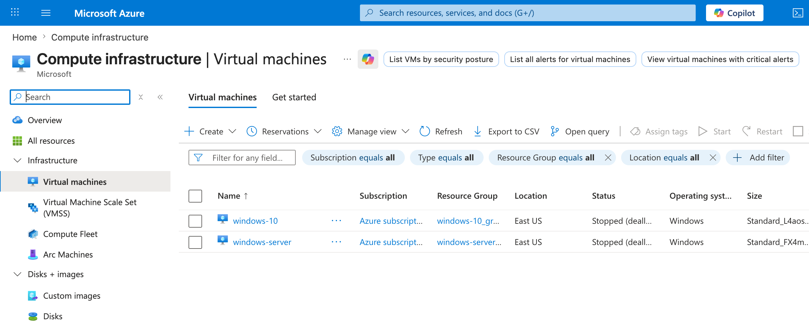

*Panel de Microsoft Azure — Compute infrastructure: VMs `windows-server` y `windows-10` desplegadas en East US*

| VM | Sistema Operativo | Rol | Tamaño | Región |
|---|---|---|---|---|
| `windows-server` | Windows Server 2022 | Domain Controller víctima (`pathsecure.local`) | Standard_FX4m | East US |
| `windows-10` | Windows 10 | Estación atacante | Standard_L4as | East US |

| Campo adicional | Detalle |
|---|---|
| Dominio AD | `pathsecure.local` |
| IP del servidor | `10.0.0.4` |
| Disco forense | Unidad `E:\` (forense_disk, asignado desde Azure) |

---

## Cronología del Incidente

```
22/04/2026  8:10 PM  ──  Ana Pérez recibe correo de phishing con troyano NJRat v0.7d adjunto
                          (Nomina_RRHH_Q2_2026.pdf.exe disfrazado con ícono PDF)

23/04/2026  4:15 AM  ──  El troyano se activa y establece beacon C2 → puerto 1177/TCP

23/04/2026  4:27 AM  ──  Atacante obtiene acceso remoto al equipo de Ana Pérez vía NJRat

23/04/2026  4:40 AM  ──  Atacante localiza passwords_temporal.txt en el escritorio del servidor
                          con credenciales admin.it : P@ssw0rdAdmin2024 en texto plano

23/04/2026  4:50 AM  ──  Atacante captura credenciales adicionales con el keylogger de NJRat

23/04/2026  4:58 AM  ──  Acceso RDP al Domain Controller con cuenta Domain Admin

23/04/2026  5:05 AM  ──  Creación de svchost_helper.ps1 en C:\Windows\System32\
                          + Tarea programada "WindowsUpdateHelper" con ExecutionPolicy Bypass

23/04/2026  5:13 AM  ──  DETONACIÓN: Script ejecutado. Contraseñas de ana.perez, carlos.mendez
                          y luis.gomez cambiadas de forma simultánea (Event ID 4724)

23/04/2026  8:05 AM  ──  Empleados no pueden iniciar sesión. Paralización total de la empresa

23/04/2026  9:00 AM  ──  Inicio de respuesta al incidente. Levantamiento forense activado
```

---

## Metodología del Ataque — Kill Chain

### 1. Reconocimiento y Acceso Inicial — Spear Phishing

El atacante envió un correo fraudulento desde `rrhh.pathsecure@gmail.com` suplantando al Departamento de Recursos Humanos. El adjunto `Nomina_RRHH_Q2_2026.pdf.exe` era el troyano **NJRat v0.7d** disfrazado con doble extensión e ícono de PDF, distribuido en un `.zip` con contraseña `1234` para evadir filtros de correo.

### 2. Establecimiento de C2 — NJRat v0.7d

Una vez ejecutado, NJRat realizó las siguientes acciones automáticas:
- Se copió en `%APPDATA%\Roaming\` con nombre aleatorio
- Creó entrada de registro para persistencia en el arranque
- Estableció conexión C2 saliente al atacante por el **puerto 1177/TCP**
- Activó **keylogger integrado** para captura de credenciales
- Habilitó **File Manager** para exploración del sistema de archivos

### 3. Escalada de Privilegios — Credenciales en Texto Plano

A través del File Manager de NJRat, el atacante localizó en el escritorio del servidor el archivo **`passwords_temporal.txt`** con las credenciales administrativas del dominio en texto plano:

```
admin.it : P@ssw0rdAdmin2024
```

Con estas credenciales estableció una sesión **RDP directa al Domain Controller** con privilegios de Domain Admin.

### 4. Implantación de la Bomba Lógica

Con acceso privilegiado al DC, el atacante ejecutó:

```powershell
# Script: C:\Windows\System32\svchost_helper.ps1
Import-Module ActiveDirectory
$usuarios = @("ana.perez", "carlos.mendez", "luis.gomez")
$nuevaPass = ConvertTo-SecureString "Locked2026!" -AsPlainText -Force
foreach ($u in $usuarios) {
    Set-ADAccountPassword -Identity $u -NewPassword $nuevaPass -Reset
}
```

Y registró la tarea programada camuflada:

| Parámetro | Valor |
|---|---|
| Nombre de tarea | `WindowsUpdateHelper` |
| Script ejecutado | `C:\Windows\System32\svchost_helper.ps1` |
| Cuenta de ejecución | `SYSTEM` |
| Política de ejecución | `ExecutionPolicy Bypass` |
| Hora de detonación | `5:13 AM — 23/04/2026` |

---

## Evidencia Forense Recolectada

La recolección se realizó siguiendo el principio fundamental: **preservar primero, analizar después**, con cadena de custodia documentada.

### Fotografías de la Escena

<table>
  <tr>
    <td align="center">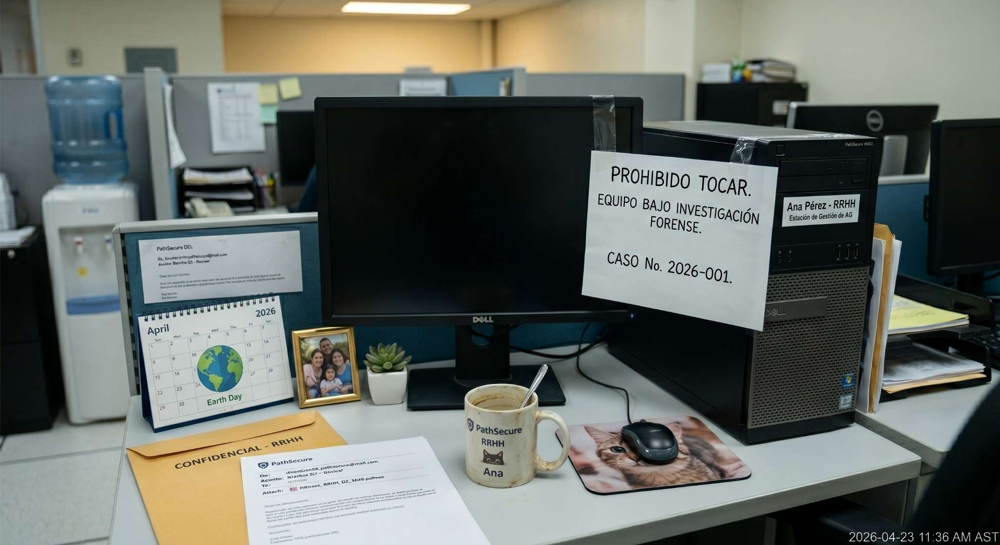<br><sub><b>Estación de trabajo de Ana Pérez (RRHH) bajo investigación — Caso 2026-001</b></sub></td>
    <td align="center">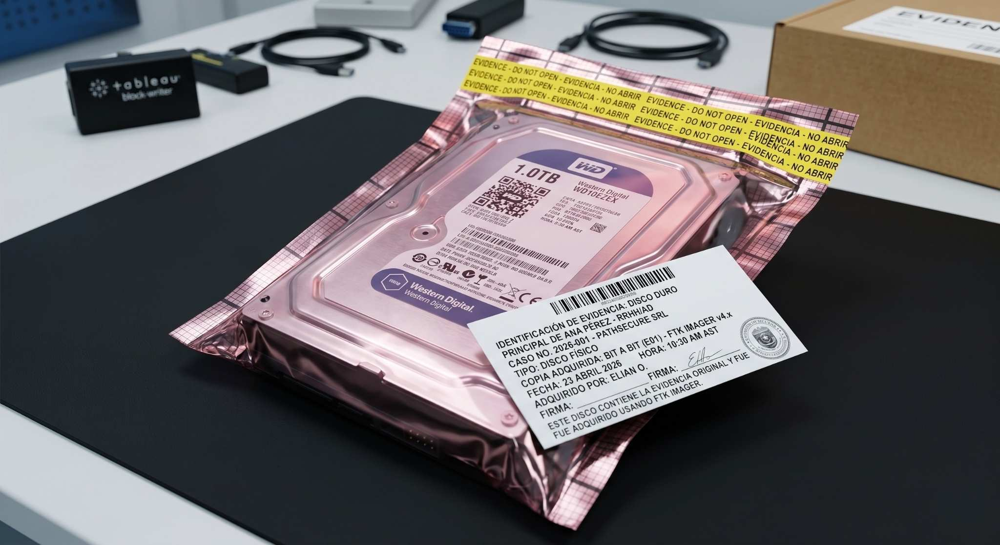<br><sub><b>Disco duro WD10EZEX 1TB embalado en bolsa antiestática con etiqueta de evidencia</b></sub></td>
  </tr>
  <tr>
    <td align="center">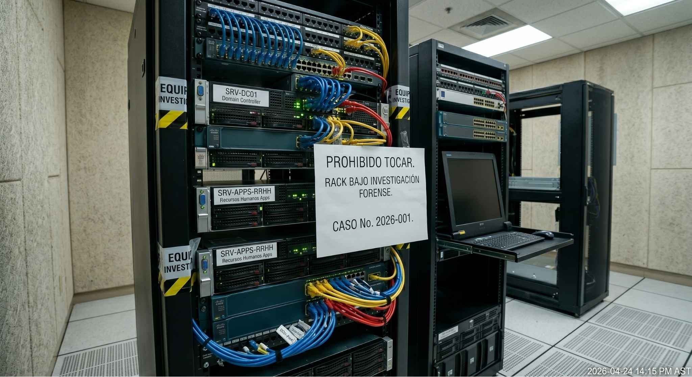<br><sub><b>Rack de servidores PathSecure (SRV-DC01, SRV-APPS-RRHH) bajo investigación forense</b></sub></td>
    <td align="center">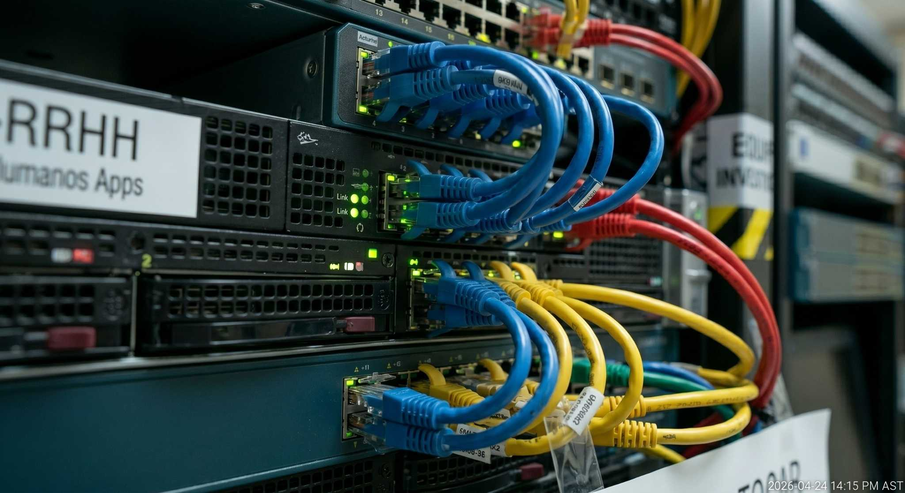<br><sub><b>Infraestructura de red — SRV-APPS-RRHH (vista detallada de cableado)</b></sub></td>
  </tr>
</table>

---

### Herramienta 1 — FTK Imager 4.7.3.81

Se utilizó FTK Imager como primera herramienta del proceso, realizando dos capturas: volcado de memoria RAM y creación de imagen forense del disco completo (formato E01).

**Paso 1 — Volcado de memoria RAM**

> Captura del contenido volátil (94 GB) para preservar procesos activos en el momento del análisis.

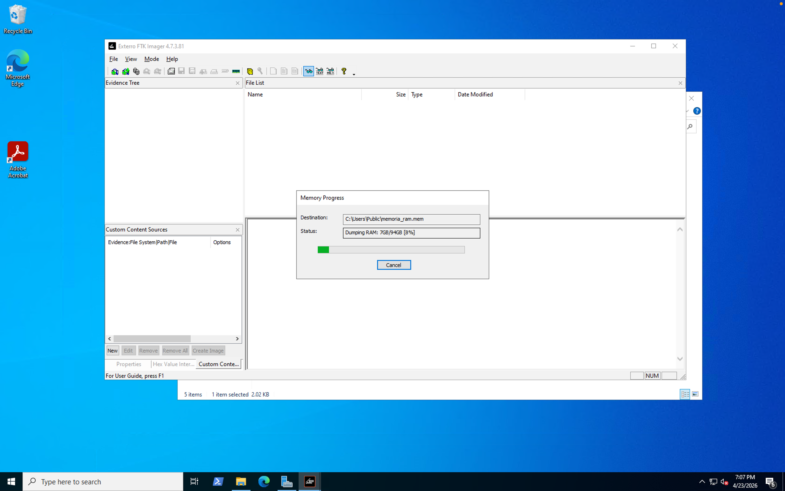

*Volcado de RAM en progreso — Destino: `C:\Users\Public\memoria_ram.mem`*

---

**Paso 2 — Registro de metadata del caso**

> Información del caso ingresada antes de iniciar la imagen del disco para garantizar la trazabilidad de la evidencia.

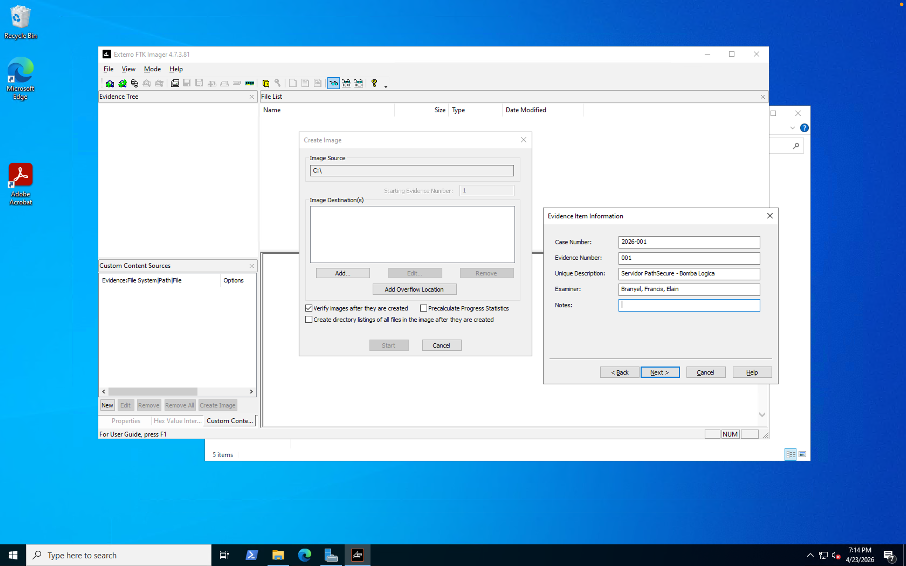

| Campo | Valor |
|---|---|
| Case Number | 2026-001 |
| Evidence Number | 001 |
| Unique Description | Servidor PathSecure - Bomba Lógica |
| Examiner | Branyel, Francis, Elian |

---

**Paso 3 — Creación de imagen forense E01**

> Imagen bit a bit del disco `C:\` con destino en la unidad forense `E:\` asignada desde Azure.

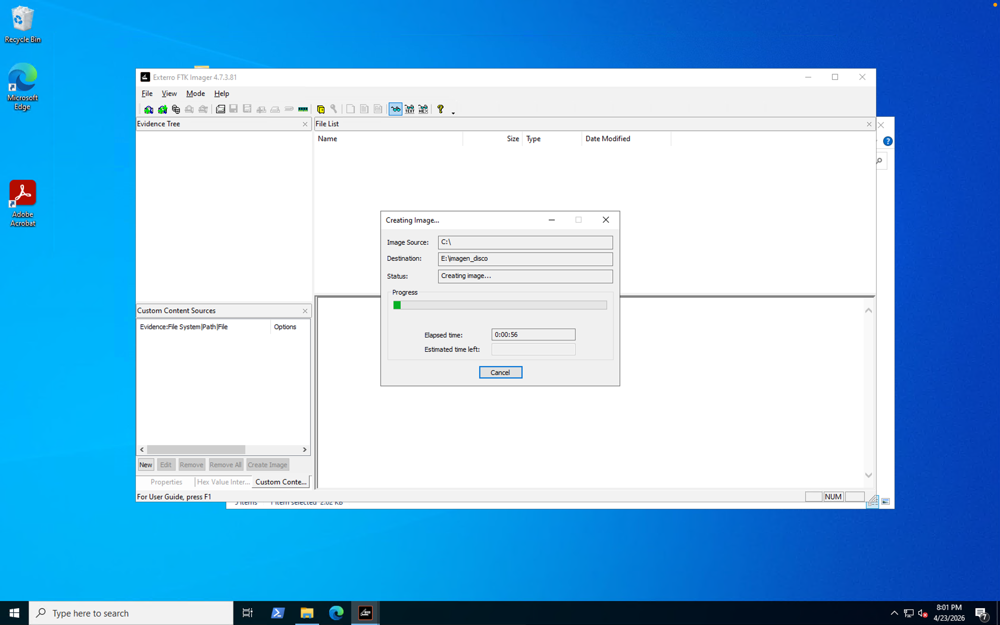

*Origen: `C:\` → Destino: `E:\imagen_disco` — Formato E01*

---

**Paso 4 — Verificación de integridad con hashes**

> FTK Imager verificó la integridad de la imagen mediante MD5 y SHA1. Resultado: **MATCH en ambos algoritmos**, confirmando que la imagen es copia fiel del original.

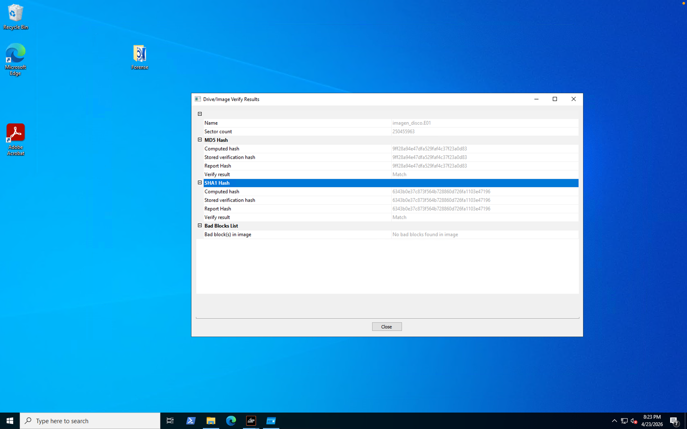

| Algoritmo | Hash | Resultado |
|---|---|---|
| MD5 | `9ff28a94e47dfa529faf4c37f23a0d83` | ✅ MATCH |
| SHA1 | `6343b0e37c873f564b728860d726fa1103e47196` | ✅ MATCH |
| Bad Blocks | — | Sin bad blocks |

---

### Herramienta 2 — HashCalc

Verificación independiente de la integridad del volcado de memoria RAM, calculando MD5 y SHA1 de forma autónoma para confirmar la cadena de custodia.

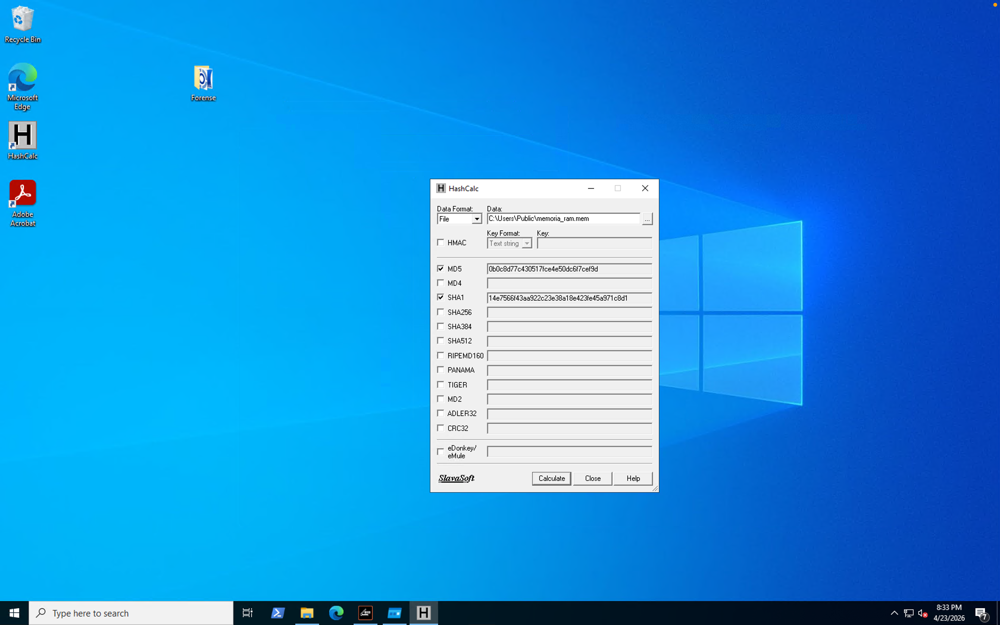

| Algoritmo | Hash del volcado RAM |
|---|---|
| MD5 | `0b0c8d77c430517fce4e50dc6f7cef9d` |
| SHA1 | `1bc79849f5e82fc267bcd3be8f3c5f17f7cf3e7b` |

---

### Herramienta 3 — Autoruns (Sysinternals)

Autoruns identificó la **tarea programada maliciosa** `WindowsUpdateHelper` configurada para ejecutar `PowerShell.exe` con `ExecutionPolicy Bypass` sobre `svchost_helper.ps1`, confirmando el mecanismo de persistencia y detonación de la bomba lógica.

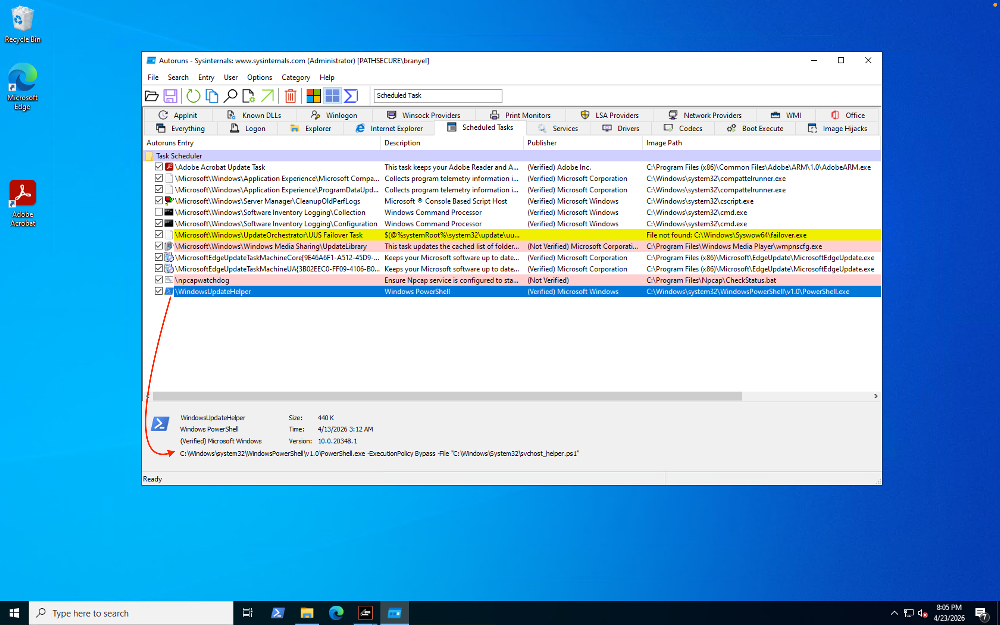

**Hallazgo clave:** La tarea `WindowsUpdateHelper` aparece resaltada entre tareas programadas legítimas del sistema. Fue diseñada con nombre similar a `WindowsUpdate` para mimetizarse con procesos del OS y evadir detección.

---

### Herramienta 4 — Process Explorer (Sysinternals)

Process Explorer reveló un proceso `svchost.exe` con comportamiento anómalo: **acceso denegado a su ruta de ejecución**, sin versión de archivo, sin Autostart Location y con timestamp de inicio a las 8:04 PM, consistente con la activación inicial del troyano NJRat.

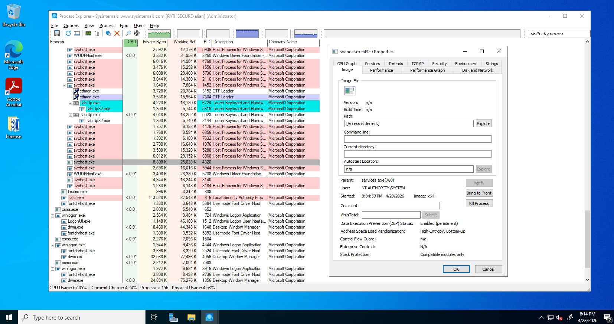

| Indicador de Compromiso | Detalle |
|---|---|
| Proceso | `svchost.exe` — PID 4320 |
| Path | Acceso denegado (no verificable) |
| Versión | Sin información de versión |
| Autostart Location | No registrado |
| Inicio | 8:04 PM (coincide con activación C2) |

---

### Herramienta 5 — Event Viewer (Registro de Seguridad de Windows)

El Visor de Eventos proporcionó la **evidencia directa e irrefutable de la detonación**. Los logs de seguridad registraron el **Event ID 4724** (An attempt was made to reset an account's password) para cada usuario, todos con timestamp idéntico: **5:13:03 AM**.

**Ana Pérez — Reset de contraseña**

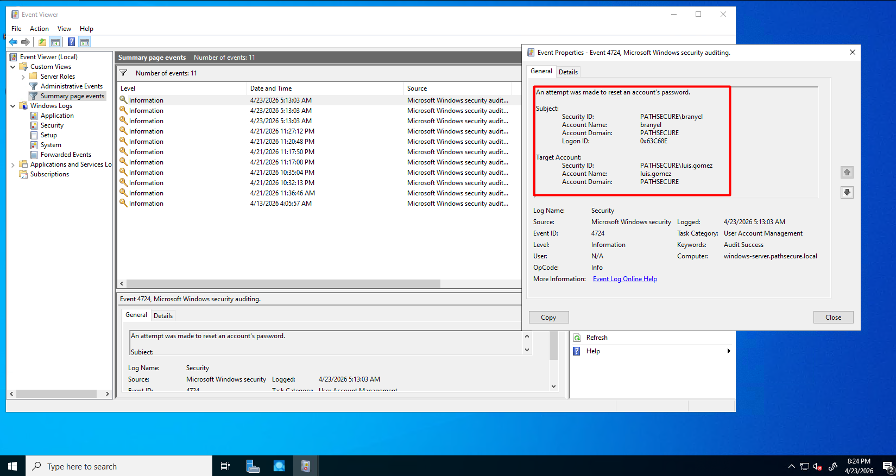

**Luis Gómez — Reset de contraseña**

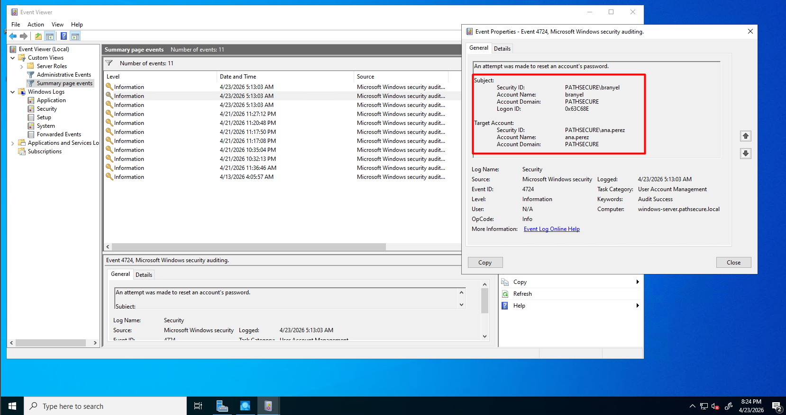

| Campo del Evento | Valor |
|---|---|
| Event ID | **4724** — Password Reset |
| Timestamp | **4/23/2026 — 5:13:03 AM** (idéntico en todos los usuarios) |
| Sujeto ejecutor | `PATHSECURE\branyel` — Logon ID `0x63C68E` |
| Usuarios afectados | `ana.perez`, `carlos.mendez`, `luis.gomez` |
| Equipo | `windows-server.pathsecure.local` |
| Task Category | User Account Management |
| Keywords | **Audit Success** |

> El timestamp idéntico en todos los eventos confirma la **ejecución automatizada y simultánea** del script PowerShell por la tarea programada `WindowsUpdateHelper`.

---

## Resumen de Evidencias

| # | Herramienta | Evidencia Recolectada | Relevancia Forense |
|---|---|---|---|
| E-01 | FTK Imager | Imagen forense E01 del disco + volcado RAM. Hashes MD5/SHA1: **MATCH** | Preservación íntegra de la evidencia digital. Garantiza que el contenido no fue alterado post-incidente |
| E-02 | Autoruns | Tarea `WindowsUpdateHelper` ejecutando PowerShell con `ExecutionPolicy Bypass` sobre `svchost_helper.ps1` | Confirma el mecanismo de persistencia y detonación de la bomba lógica |
| E-03 | Process Explorer | `svchost.exe` PID 4320 con path denegado, sin versión, sin Autostart — iniciado a las 8:04 PM | Indica proceso malicioso activo durante el incidente, posiblemente componente NJRat |
| E-04 | Event Viewer | Event ID 4724 para `ana.perez`, `luis.gomez`, `carlos.mendez` a las 5:13:03 AM del 23/04/2026 | Evidencia directa e irrefutable de la detonación y el cambio masivo de contraseñas |
| E-05 | HashCalc | MD5 y SHA1 calculados independientemente para `memoria_ram.mem` | Cadena de custodia: confirma que la imagen de RAM no fue modificada durante el análisis |

---

## Cadena de Custodia

> Documento completo: [docs/cadena-de-custodia.md](docs/cadena-de-custodia.md)

| Objeto | Descripción | Fecha / Hora | Entregado por | Recibido por |
|---|---|---|---|---|
| Volcado RAM | 84 GB DDR4 4800 MHz DIMM | 23/04/2026 — 2:58 PM | Elian Leonardo (2023-0961) | Francis Vidal (2024-1183) |
| Disco Duro | WD10EZEX 1TB — Imagen E01 adquirida con FTK Imager | 23/04/2026 — 2:58 PM | Branyel Pérez (2024-1489) | Francis Vidal (2024-1183) |

---

## Conclusiones

La investigación forense confirma que el incidente fue un **ataque dirigido y premeditado** que siguió una cadena de compromiso clásica:

1. **Phishing como vector inicial** — Ingeniería social con correo de alta credibilidad explotando la confianza en comunicaciones internas de RRHH.
2. **RAT para acceso persistente** — NJRat v0.7d proporcionó al atacante acceso remoto total: keylogger, file manager y shell remoto.
3. **Error humano crítico** — El almacenamiento de credenciales administrativas en texto plano fue el factor decisivo que permitió la escalada al Domain Controller.
4. **Bomba lógica efectiva** — Script PowerShell camuflado como proceso del sistema + Scheduled Task con nombre legítimo = ejecución exitosa sin detección previa.
5. **Impacto máximo calculado** — Detonación a las 5:13 AM para garantizar la interrupción máxima al inicio de la jornada laboral.

### Recomendaciones

- Implementar **MFA** para todos los accesos administrativos al dominio
- **Prohibir credenciales en texto plano** — implementar gestor de contraseñas corporativo
- **Capacitar empleados** en identificación de correos phishing y spear phishing
- Restringir ejecución de scripts PowerShell no firmados mediante **Group Policy**
- **Activar auditoría completa** en el Domain Controller desde el inicio del sistema
- Implementar **SIEM** para detección de comportamiento anómalo en tiempo real
- **Auditar Scheduled Tasks** periódicamente para detectar tareas no autorizadas
- **Segmentar la red** para limitar el movimiento lateral ante compromiso de una estación de trabajo

---

## Documentación Completa

| Documento | Descripción |
|---|---|
| [Informe de Investigación Forense](docs/informe-investigacion.md) | Informe técnico completo con análisis detallado de cada herramienta y hallazgo |
| [Informe Ejecutivo](docs/informe-ejecutivo.md) | Resumen del incidente para dirección y partes no técnicas |
| [Cadena de Custodia](docs/cadena-de-custodia.md) | Formulario oficial de cadena de custodia de las evidencias digitales |

---

<div align="center">

**Instituto Tecnológico de las Américas (ITLA)**  
Informática Forense — Grupo 6 · Santo Domingo, República Dominicana  
Caso cerrado: 23 de abril de 2026

</div>
